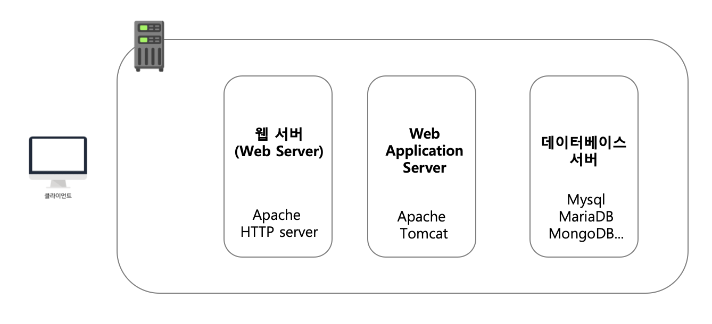
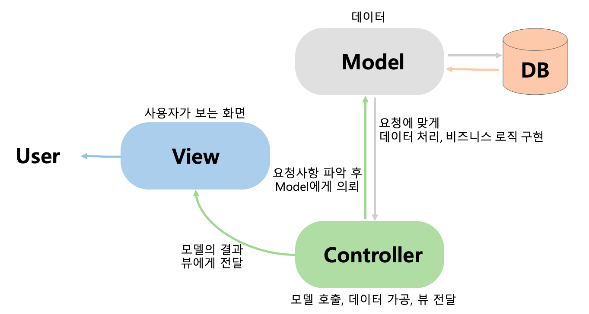
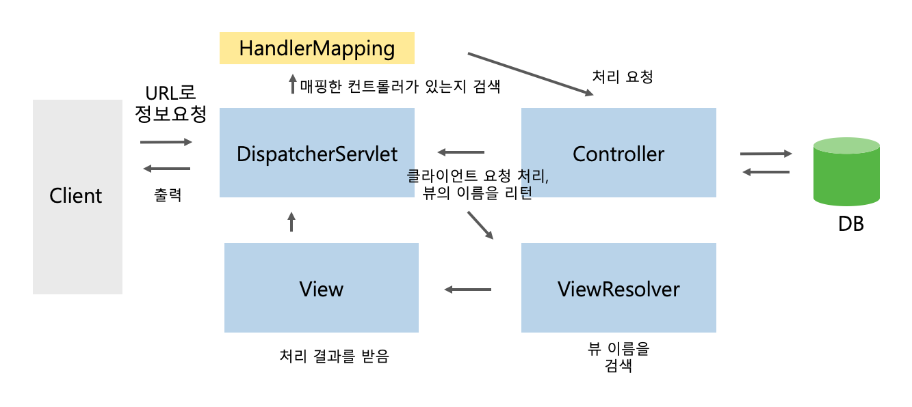
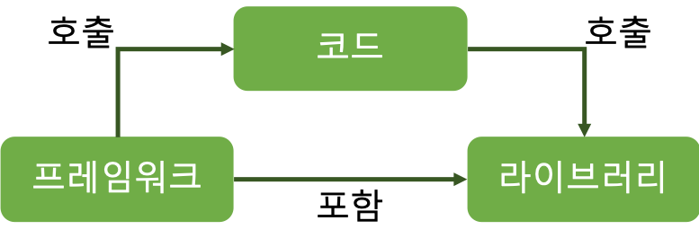
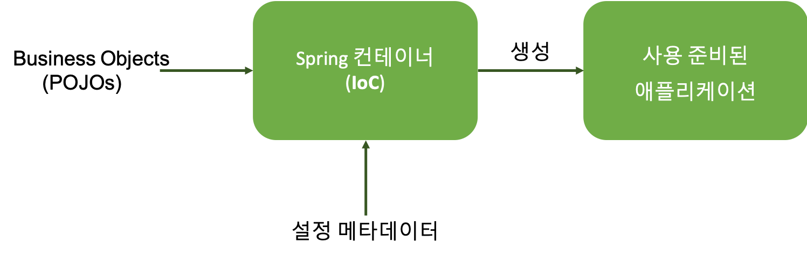
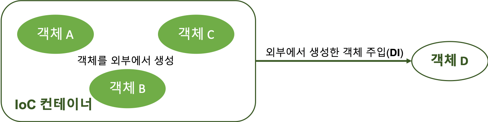
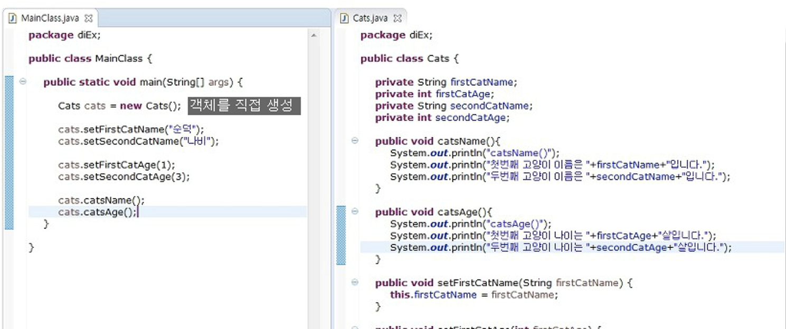
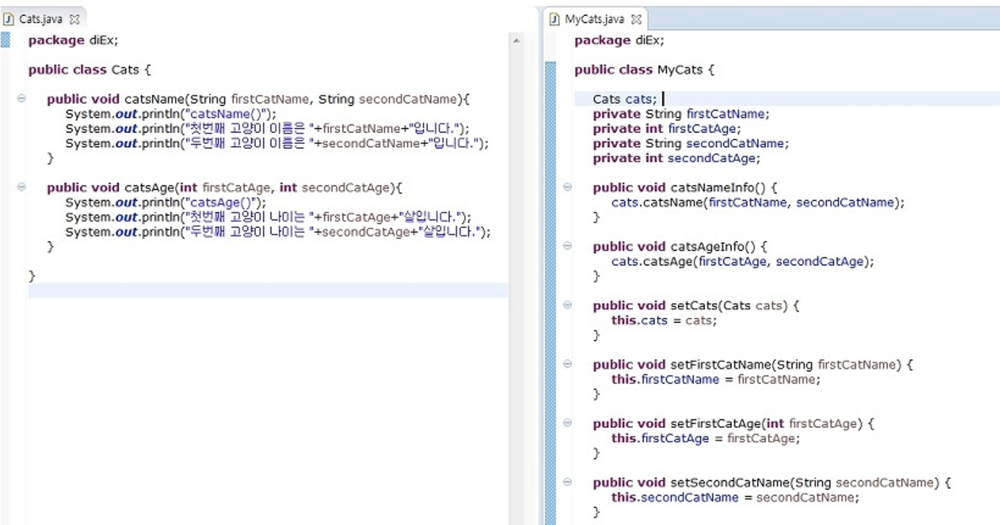
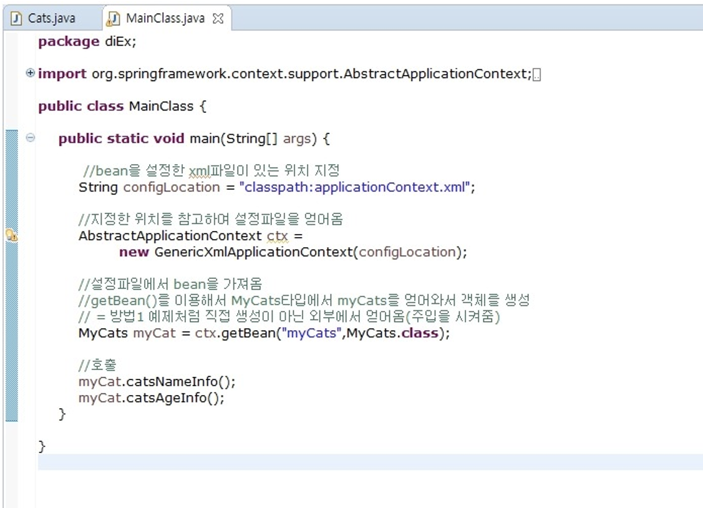
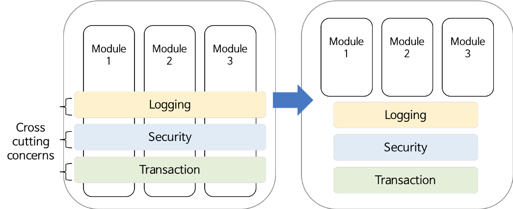

# 서버의 개념

### 1. 서버의 역할  
* 클라이언트가 요청을 하면 서버에서 응답 값을 보냄

### 2. HTTP와 CRUD
* `HTTP(Hyper Text Transfer Protocol)` : 하이퍼미디어 문서를 주고 받을 수 있는 프로토콜. http 형식으로 클라이언트와 서버가 요청/응답을 주고받음. (json, xml 형태 등으로 제공)
```json
{
    "articles" : [
        {"title": "안녕하세요"},
        {"title": "서버 스터디!"}
    ]
}
```
* `CRUD` : 기본적인 데이터 처리 기능.<br>
Create - POST<br>
Read - GET<br>
Update - PUT<br>
Delete - DELETE<br>

### 3. 서버 아키텍처


* WAS : 웹 서버로는 처리할 수 없는 **동적 컨텐츠인 데이터베이스 조회 및 로직 처리**를 담당한다. 사전적 정의로는 인터넷 상에서 HTTP 프로토콜을 통해 사용자 컴퓨터나 장치에 어플리케이션을 수행해주는 **미들웨어**이며, 주로 동적 서버 컨텐츠를 수행하는 것으로 일반적인 웹 서버와 구별이 된다. 주로 데이터베이스 서버와 같이 수행된다.
    - 효율성 때문에 서버가 나뉘게 됨!<br>
    _WAS는 비즈니스 로직 처리하기 바빠서 웹 서버에게 정적 컨텐츠 처리를 맡김. 그렇지 않으면 속도가 느려진다. 따라서 웹 서버를 두고 플러그인 형태로 WAS를 두어 데이터를 효율적으로 처리하도록 구성._<br>
    [참조 링크](https://mellonia-lab.tistory.com/73)


### 4. RESTful API
* REST : HTTP 기반으로 필요한 자원에 접근하는 방식을 정해놓은 아키텍처.
    ```text
    속성1 : 서버에 있는 모든 resource는 각 resource 당 클라이언트가 바로 접근 할 수 있는 고유 URI가 존재.

    속성2 : 모든 요청은 클라이언트가 요청할 때마다 필요한 정보를 주기 때문에 서버에서는 세션 정보를 보관할 필요가 없음. 그렇기 때문에 서비스에 자유도가 높아지고 유연한 아키텍쳐 적응이 가능.

    속성3 : HTTP 메소드를 사용. 모든 resource는 일반적으로 http 인터페이스인 GET, POST, PUT, DELETE 4개의 메소드로 접근 되어야 함.

   속성4 : 서비스 내에 하나의 resource가 주변에 연관 된 리소스들과 연결되어 표현이 되어야 함.
    ```
* API 설계의 중심에 자원(Resource)이 있고, HTTP Method를 통해 자원을 처리하도록 설계하는 것.
* 제약조건 및 장단점 : [참조 링크](https://medium.com/@dydrlaks/rest-api-3e424716bab)


#### *URI vs. URL vs. URN
| URI | URL | URN |
| --- | --- | --- |
| Uniform Resource **Identifier** | Uniform Resource **Locator** | Uniform Resource **Name** |
| 해당 자원을 식별하고 위치를 지정할 수 있는 정보.<br>프로토콜이 반드시 붙어서 나타내는 유일한 주소. | URI의 한 종류.<br> 서버에 있는 파일 위치를 나타내는 자원.<br> 파일 위치의 실제 경로.<br> 자원이 옮겨지면 해당 URL을 더이상 사용할 수 없음. | URI의 한 종류.<br> 자원 위치에 영향 안받는 그냥 이름.<br> 여기저기 옮겨도 문제없이 동작. |


# MVC 패턴


* _Controller_ : 클라이언트의 요청을 실질적으로 수행하는 모델을 호출하고, 데이터를 가공하고, 모델이 일을 마치면 그 결과를 뷰에게 전달한다.
* _Model_ : 컨트롤러의 호출을 받으면 요청에 맞게 역할을 수행한다. 여기서 DB와 연결하고, CRUD등 데이터 처리가 이루어진다.
* _View_ : 모델의 결과 값을 가지고 사용자에게 보여줄 결과 화면을 만드는 영역이다.


## Spring MVC 패턴


* _DispatcherServlet_ : Front Controller 역할(모든 웹 어플리케이션에 대한 요청을 받고, 그 요청을 Controller로 분배해주는 패턴). Spring MVC의 웹 요청 Life Cycle을 주관.  
[참조 링크](https://minwan1.github.io/2018/05/28/2018-05-28-spring-mvc/)


<br>
<br>

---

<br>
<br>

# Framework vs. Library
## Framework (뼈대)  
1. SW의 특정 문제를 해결하기 위해서 **상호 협력**하는 **클래스와 인터페이스 집합**
2. 완성된 어플리케이션이 아닌 프로그래머가 완성시키는 작업
3. 특정 개념들의 추상화를 제공하는 여러 클래스나 컴포넌트로 구성
4. 컴포넌트들은 재사용 가능
5. 높은 수준에서 패턴들을 조작화 가능

## Library  
1. **단순 활용 가능한 도구들**의 집합
2. 개발자가 만든 클래스에서 호출하여 사용, 클래스의 나열로 필요한 클래스 불러서 사용  


<br>
<br>


<br>
<br>

| Framework | Library |
| --------- | ------- |
| 전체적인 흐름을 **스스로** 쥐고 있음<br>사용자가 그 안에서 필요한 코드를 짜 넣음<br>이미 프레임워크 안에 제어 흐름에 대한 주도성이 내재<br>프레임워크에 들어가서 사용! | **사용자**가 전체적인 흐름을 만들며 라이브러리 갖다 씀<br>호출하는 측에 전적으로 주도성 있음! |
| Ex) 자동차, 배, 비행기 (사람이 규칙에 맞게 조종) | Ex)톱, 망치, 삽 (사람이 도구를 선택) |


<br>

# Spring Framework
* **자바** 엔터프라이즈 개발을 위한 **오픈소스** 애플리케이션 프레임워크
* **동적인 웹 개발**을 위한 여러 서비스 제공
* **POJO** 기반
> POJO : _Plain Old Java Object_<br>- 상속, 인터페이스가 필요 없는 아주 가볍고 단순한 객체<br>- 원하는 Business Logic 만 넣을 수 있게 해줌

<br>

## Spring의 특징

### 1. 경량 *컨테이너
- 크기와 부하 측면에서 경량!
- 자바 객체를 직접 관리.
- 각각의 객체 생성, 소멸과 같은 Life Cycle을 관리. 스프링으로부터 필요한 객체를 얻어옴.
> *컨테이너 : 객체 관리를 주로 수행하는 그릇

- _왜 컨테이너 사용?_<br>객체지향 프로그래밍은 **낮은 결합도 & 높은 캡슐화** 추구<br>=>객체 간 **의존성을 낮추기 위해** spring container 이용<br><br>

<br><br>

### 2. 제어 역행(IoC : Inversion of Control)
- 애플리케이션의 느슨한 결합을 도모
- 컨트롤의 제어권이 프레임워크에 있어서 필요에 따라 스프링에서 사용자 코드를 호출
- 실행에 필요한 객체의 생성, 사용 등 제어 권한을 위임하는 것<br><br>

<br><br>

### 3. 의존성 주입(DI : Dependency Injection)
- 각각의 계층이나 서비스들 간에 의존성이 존재할 경우, 프레임워크가 서로 연결시켜줌
- POJO 객체들 사이의 의존 관계를 Spring이 알아서 연관성 맺어줌
- 다양한 DB 사용이 가능


> **<직접 생성>**<br><br>
<br>MainClass 가 Cats 를 의존<br>MainClass 에서 직접 Cats 클래스를 생성해서 사용<br><br><br>
**<DI 방식>**<br><br>
<br>Cats 와 MyCats 로 나눔!<br>Cats – 실제 기능을 하는 메소드 / MyCats – 필요한 필드 선언 후 setter 만듦<br><br>_자바 특성인 정보은닉 때문에 setter 사용<br>private인 클래스의 변수에 접근하기 위해<br>public인 setter로 read. 클래스 외부에선 접근 X_
<br><br><br>외부(ConfigLocation)에서 객체 얻어와서 사용!<br>직접 생성하는 방법처럼 Cats cats = new Cats(); 하지 않고 외부에서 얻어와서 객체 생성<br>[참조 블로그](https://private.tistory.com/39)<br><br>* 고양이 말고 강아지 정보를 보고 싶으면?<br>- 직접 생성 : MainClass 코드를 싹 다 고쳐야 함<br>- DI 방식 : 설정파일만 바꾸면 됨(DB마다 메소드를 바꾸지 않아도 되므로 다양한 DB 활용에 좋음) 


<br><br>

### 4. 관점지향 프로그래밍(AOP : Aspect-Oriented Programming)
- 트랜잭션, 로깅, 보안 등 여러 모듈에서 공통적으로 사용하는 기능을 분리해서 관리 가능
- 공통 관심사를 분리하여 개발, 실행 시 서로 조합
- 코드를 단순하고 깔끔하게 작성 가능
<br><br>