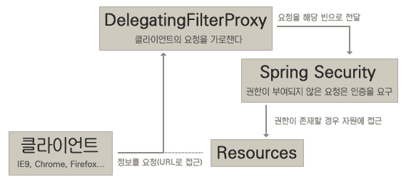

# 트랜잭션

### 데이터베이스에서의 트랜잭션

: 하나의 논리적 기능을 수행하기 위한 작업의 단위.

#### 트랜잭션의 특징(ACID)

* Atomicity(원자성) : 트랜잭션은 자기의 연산을 **전부 또는 전무** 실행만이 있지 일부 실행으로 트랜잭션의 기능을 갖는 것은 아니다.
* Consistency(일관성) : 트랜잭션이 그 실행을 성공적으로 완료하면 **언제나 일관성있는 데이터베이스 상태**로 변환한다. 즉, 트랜잭션 실행의 결과로 데이터베이스 상태가 모순되지 않는다.
* Isolation(격리성) : 트랜잭션이 실행 중에 있는 연산의 중간 결과는 **다른 트랜잭션이 접근할 수 없다**.
* Durability(영속성) : 트랜잭션이 일단 그 실행을 성공적으로 완료하면 그 결과는 영속적이다. 따라서 시스템은 어떤 경우에도 완료된 **결과의 영속성을 보장**해야 한다.

#### 트랜잭션의 상태

* 활동(Active) : 트랜잭션이 Begin_Trans에서부터 실행을 시작하였거나 실행 중인 상태
* 부분 완료(Partially Committed) : 트랜잭션이 마지막 명령문을 실행한 직후의 상태
* 실패(Failed) : 정상적 실행을 더 이상 계속할 수 없어서 중단한 상태
* 철회(Aborted) : 트랜잭션이 실행에 실패하여 Rollback 연산을 수행한 상태
* 완료(Committed) : 트랜잭션이 실행을 성공적으로 완료하여 Commit 연산을 수행한 상태

[참고 블로그](https://blog.naver.com/sillllver/90179069288)

<br>

### 스프링에서 트랜잭션 사용

어노테이션 사용
```java
@Service
public class BoardServiceImpl implements BoardService {

    @Override
    @Transactional
    public List<BoardVO> insertBoardList() throws Exception {
        boardMapper.insertBoardList();
    }  
 }
```

<br><br>

***

<br><br>


# 보안

### 스프링 시큐리티(Spring Security)

: 어플리케이션의 보안을 위해 권한(Authorization)과 인증(Authentication) 에 대한 기능을 제공. 크리덴셜 기반 인증을 사용한다.

> _크리덴셜(Credential:자격) 기반 인증_ : 우리가 웹에서 사용하는 대부분의인증 방식은 크리덴션 기반의 인증 방식입니다. 즉 권한을 부여받는데 1차례의 인증과정이 필요하며 대개 사용자명과 비밀번호를 입력받아 입력한 비밀번호가 저장된 비밀번호와 일치하는지 확인합니다. 일반적으로 스프링 시큐리티에서는 아이디를 프린시플(principle), 비밀번호를 크리덴셜(credential)이라고 부르기도 합니다.

<br><br>

DelegatingFilterProxy 클래스가 사용자의 요청을 가로채고, 이를 해당 빈으로 전달한다. 권한이 부여된 요청만 자원에 접근할 수 있다.

[참고 블로그](http://egloos.zum.com/springmvc/v/504862)